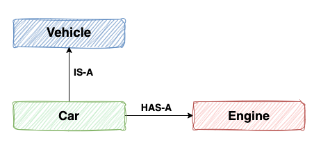

# Object-Oriented Principle
***

## **Favour composition over inheritance**

### Inheritance (IS-A):

A mechanism in which a new class to be derived from an existing class, enabling the new class to inherit attributes and methods from the parent class.

**Coupling:** Tight coupling between parent and child class.

**Relationship Indication:** IS-A denotes that a class is a specific type of another class, inheriting properties and behaviors from its parent class.

`A Car IS-A Vehicle.`

### Composition (HAS-A):

A design principle where classes implement polymorphism and reuse code by including instances of other classes that provide the necessary functionality.

**Coupling:** This loose coupling enhances the system's modularity and simplifies modifications by relying on the composition of objects with clearly defined interfaces. It often involves using interfaces and delegation.

**Relationship Indication":** HAS-A denotes that a class composed of one or more objects from other classes.

`A Car HAS-A Engine.`

### Why Favour composition over inheritance?
* **Flexibility:**\
Composition provides the ability to change components without impacting the containing class, allowing modifications to a class’s behavior at runtime.

* **Encapsulation:**\
Composition maintains encapsulation by hiding internal details and exposing only necessary interfaces. In contrast, inheritance may expose the parent class's internals to the child class, potentially breaking encapsulation.

* **Reusability:**\
Composition allows components to be reused across different classes.

* **Loose Coupling:**\
Composition depends on well-defined interfaces for object composition, whereas inheritance creates a tight coupling between parent and child classes.

* **Avoiding the Fragile Base Class Problem:**\
Composition, by relying on well-defined interfaces and contained objects, makes changes more controlled and predictable. Inheritance, on the other hand, can lead to unexpected behaviors since modifications to a base class might inadvertently affect all derived classes.

**Conclusion**

Favoring composition over inheritance provides greater flexibility, better encapsulation, and easier maintenance. It encourages the design of systems where components can be easily reused and replaced, promoting a more modular and adaptive codebase.
